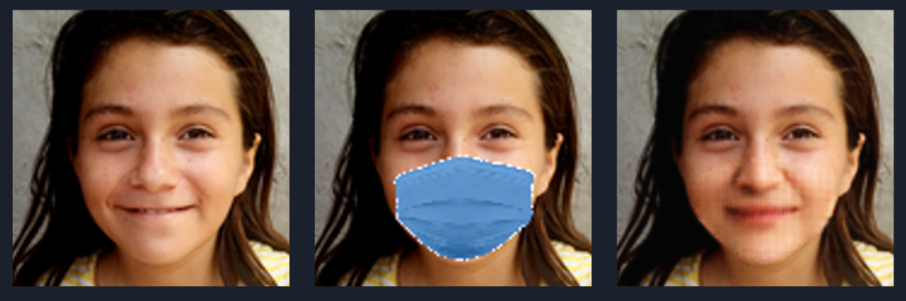
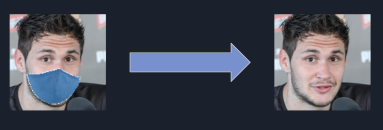
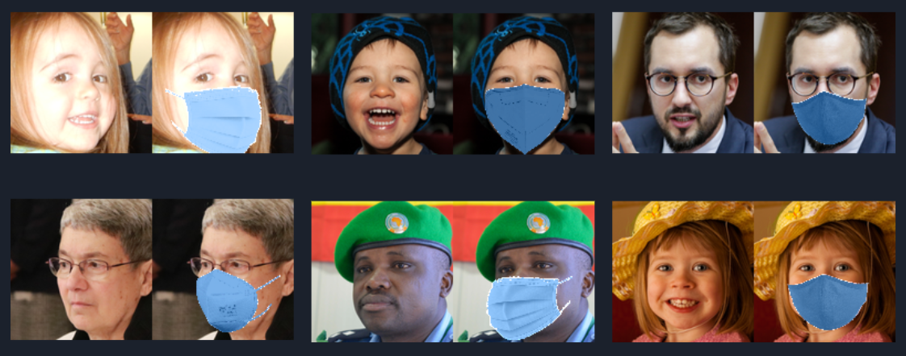

# UnmaskMe



## Motivation



Covid-19 was introduced to the world on March 19 and ever since people are wearing masks in their daily life. It has
become more common to see a masked face than an uncovered smiling face as we used to before. As a result, lots of the
photos taken today are of masked people, instead of normal faces as we know and love.

In this project, we aim to remove the masks out of people's faces without the risk of catching the virus. We face the
task of generating realistic faces from masked faces images.

Apart from spreading joy in this gray reality of the Covid-19, this application might have usage in the security
industry when trying to estimate a person's face out of a masked image. This task essentially includes two stages. The
first is the detection and segmentation of the masked area and the second is generating a complementary face instead of
the masked area.

To our knowledge, no such work exists. However, We base our work on several papers from different fields. In order to
obtain an aligned masked dataset we use MaskTheFace , a model trained to convert face image to a masked face image. For
the main task we use cGANs architecture of pix2pix.

## Installation

To install requirements simply run this within the project root:

```
pip install -r requirements.txt 
```

Prerequisites are

| Package | Relation | Version |
| ------- | -------- | ------- |
| certifi | == | 2020.4.5.1 |
| click | == | 7.1.2 |
| dlib | == | 19.19.0 |
| dotmap | == | 1.3.14 |
| face-recognition | == | 1.3.0 |
| face-recognition-models | == | 0.3.0 |
| numpy | == | 1.18.4 |
| opencv-python | == | 4.2.0.34 |
| Pillow | == | 7.1.2 |
| tqdm | == | 4.46.0 |
| wincertstore | == | 0.2 |
| imutils | == | 0.5.3 |
| requests | == | 2.24.0 |
| torch | \>= | 1.4.0 |
| torchvision | \>= | 0.5.0 |
| dominate | \>= | 2.4.0 |
| visdom | \>= | 0.1.8.8 |

## Usage

### Training

#### Generating The Dataset


Download FFHQ thumbnails 128x128 data from this
[link](https://archive.org/download/ffhq-dataset/thumbnails128x128.zip).

After the download is complete, run the following script in the root of the project

```
python generate_masked_dataset.py --ffhq-root path\to\download\dir --combined-dcombinedata-dir \path\to\combined\dir
```

|Argument|Description|
|--------|-----------|
|--ffhq-root| FFHQ facedataset images dir.|
|--flattened-dir| dir for extracting images from FFHQ sub dirs.|
|--masked-data-dir| dir for saving masked face images.|
|--combined-data-dir| dir for final result.|
|--train-test-ratio| percentage of train set from all dataset|

#### Pretraing model

Our pretrained model can be found [here]()

#### Training script

From cyclegan dir run:

```
python train.py --dataroot path\to\combined\data\dir --model pix2pix --name face2mask --print_freq 50 --num_threads 12
```

For a detailed explanation on parameters
see [link to options](https://github.com/rvainshtein/unmaskme/blob/77d18a082daabe2cbf695956f0741ff15bf90dc7/cyclegan/options/base_options.py#L20)
.

### Inference

#### Results on Test Set

From cyclegan dir run:

```
python test.py --dataroot \path\to\generated\data\dir --model pix2pix --name face2mask --direction BtoA --results_dir ./results/
```

For a detailed explanation on parameters
see [link to options](https://github.com/rvainshtein/unmaskme/blob/77d18a082daabe2cbf695956f0741ff15bf90dc7/cyclegan/options/base_options.py#L20)
.

## References

- [CycleGAN & pix2pix repo](https://github.com/junyanz/pytorch-CycleGAN-and-pix2pix)
- [pix2pix paper](https://arxiv.org/pdf/1611.07004)
- [CycleGAN paper](https://arxiv.org/pdf/1703.10593)
- [MaskTheFace repo](https://github.com/aqeelanwar/MaskTheFace)

